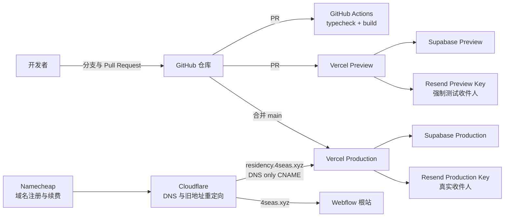

# 4Seas Residency 部署与维护手册

本文面向第一次接触本项目的团队成员。它说明项目依赖哪些平台、负责人第一次如何配置、开发者日常如何修改代码，以及部署人如何上线、检查和回滚。

本文不保存任何密码、API Key、数据库连接串或恢复码。文中提到的密钥都应通过私密渠道交付，并保存在对应平台或本地 `.env.local` 中。

## 1. 先理解整套系统

正式网站使用独立子域名：

```text
https://residency.4seas.xyz
```

`4seas.xyz` 根站继续由 Webflow 提供。旧地址 `4seas.xyz/residency/*` 仅作为迁移入口，最终由 Cloudflare 301 跳转到新子域名。



最重要的发布规则只有三条：

1. GitHub `main` 是唯一生产分支。
2. 只有合并到 `main` 才会部署 Production；普通分支和 PR 只能部署 Preview。
3. 谁合并并触发本次部署，谁就负责查看构建、检查线上页面，并在出错时回滚。

## 2. 平台清单与当前方案

| 平台 | 用途 | 当前方案 | 日常负责人要做什么 |
| --- | --- | --- | --- |
| Namecheap | `4seas.xyz` 注册与续费 | 保留现有注册商 | 保证自动续费、付款方式和恢复方式有效 |
| Cloudflare | DNS、Resend DNS、旧 URL 重定向 | Free 即可 | 修改域名记录和 302/301 规则 |
| Webflow | `4seas.xyz` 根站 | 保持现状 | 本项目不修改 Webflow 页面 |
| GitHub | 代码、Issue、PR、CI、Dependabot | `4seas-community/4seas-residency` | 代码协作和合并入口 |
| Vercel | Preview、Production、日志、回滚 | 先使用 Hobby | 负责人管理项目；通过 Shareable Link 让其他人验收 PR |
| Supabase | Postgres 数据库 | Pro 组织下两个独立项目 | 分离 Preview 和 Production 数据 |
| Resend | 状态通知邮件 | Free 起步 | 管理发件域名和两把发送 Key |

当前预计新增固定成本主要是 Supabase：Pro 组织包含一个 Micro 项目，再增加一个 Micro 项目后合计约 35 美元/月；实际价格以 [Supabase 官方价格](https://supabase.com/pricing) 为准。Vercel Hobby 仅应在项目符合其非商业使用条件时采用；不再符合条件或需要多人直接管理 Vercel 时升级 Pro。

账号不需要设计复杂角色。平台负责人持有最高权限，并按实际需要添加或移除成员。普通开发者不需要 Namecheap、Cloudflare、Vercel Production、Supabase Production 或 Resend Production 权限。

## 3. 仓库已经配置好的内容

以下内容已经在代码仓库中，不需要新人重新创建：

- GitHub Actions 工作流：`.github/workflows/ci.yml`；
- `main` 分支保护：必须经过 PR，并通过 `Typecheck and build` 与 `Vercel`；
- 禁止 force push 和删除 `main`；
- Dependabot Alerts 与 Security Updates；
- Node.js 22 和 pnpm 10.5.2 版本约束；
- Vercel Git 集成所需的 Next.js 项目结构；
- Supabase migrations：`supabase/migrations/`；
- 不含密钥的环境变量模板：`.env.example`；
- Preview 邮件收件人覆盖保护；
- 旧 `/residency/*` 地址的过渡重定向。

平台负责人仍需完成的外部配置：

- [ ] Namecheap 自动续费和恢复方式；
- [ ] Cloudflare 中的 `residency` CNAME；
- [ ] Vercel 中的正式域名、Node 版本和分环境变量；
- [ ] Supabase Preview 项目；
- [ ] Resend 的 `mail.4seas.xyz` 验证和两把 API Key；
- [ ] Cloudflare 旧地址 302，验证后再改 301；
- [ ] 首次切换完成后收紧 v1 旧表的 RLS policies。

## 4. 负责人第一次配置

以下步骤只需完整执行一次。建议严格按顺序操作。

### 4.1 Namecheap：确认域名不会丢失

1. 登录持有 `4seas.xyz` 的 Namecheap 账号。
2. 确认域名状态正常，Nameserver 仍指向 Cloudflare。
3. 开启自动续费并检查付款方式。
4. 开启两步验证，妥善保存恢复方式。
5. 恢复邮箱最好独立于 `4seas.xyz`，避免域名故障时无法恢复账号。

Namecheap 只管理注册和续费，不在这里修改本项目的 DNS。

### 4.2 GitHub：仓库与合并规则

仓库地址：`4seas-community/4seas-residency`。

需要确认：

1. Vercel GitHub App 可以读取并部署这个仓库。
2. `main` 的 required checks 包含：
   - `Typecheck and build`
   - `Vercel`
3. PR 合并前必须与最新 `main` 同步。
4. 不允许 force push 或删除 `main`。
5. 长期开发者授予仓库 Write；外部贡献者使用 fork。
6. PR 默认交给当前维护负责人处理；`.github/CODEOWNERS` 会自动请求负责人查看。

不强制另一位成员批准，也不设置自动合并。检查通过后由负责本次上线的人合并。

### 4.3 Supabase：建立两个完全独立的项目

在同一个 4Seas Supabase Pro 组织下创建：

```text
4seas-residency-production
4seas-residency-preview
```

两者不能共用数据库、Service Role Key 或数据库密码。

Production 使用正式申请数据；Preview 只使用可随时重建的虚构数据，不复制真实申请人的姓名、邮箱、联系方式或申请内容。

创建 Preview 后，从仓库根目录执行全部 migration：

```bash
export SUPABASE_PREVIEW_DB_URL='负责人私密提供的 Preview 数据库连接串'

pnpm exec supabase db push \
  --db-url "$SUPABASE_PREVIEW_DB_URL" \
  --dry-run

pnpm exec supabase db push \
  --db-url "$SUPABASE_PREVIEW_DB_URL"

unset SUPABASE_PREVIEW_DB_URL
```

`009_migrate_v1_data.sql` 在 Preview 找不到旧版表时会安全跳过；在含旧表的 Production 中仍可幂等导入。

保存两套项目各自的：

- Project URL；
- Service Role Key；
- 数据库连接串或数据库密码。

普通开发者只获得 Preview 值。Production 值只配置在 Vercel Production 或由当前部署负责人临时使用。

### 4.4 Resend：建立正式发件域名

1. 在 4Seas 使用的 Resend 账号中添加：

   ```text
   mail.4seas.xyz
   ```

2. Resend 会显示需要添加的 SPF、DKIM 等记录。
3. 在 Cloudflare DNS 中逐条复制，类型、名称和值必须与 Resend 显示的一致。
4. 等 Resend 显示域名 Verified。
5. 分别创建两把仅发送权限、限制到该域名的 Key：
   - Production Key
   - Preview Key
6. 发件人使用：

   ```text
   4Seas Residency <residency@mail.4seas.xyz>
   ```

7. `EMAIL_REPLY_TO` 使用一个真实可收件的团队邮箱，例如 `hello@4seas.xyz`。

Preview 始终配置：

```text
EMAIL_RECIPIENT_OVERRIDE=delivered+residency-preview@resend.dev
```

这是 Resend 官方测试地址的带标签形式。即使 Preview 数据里填了真实邮箱，代码也只会把邮件发到测试地址。代码在 `VERCEL_ENV` 不是 `production` 时也会自动使用该测试地址，防止负责人漏配。Production 绝对不能设置这个变量。

### 4.5 Vercel：创建和绑定项目

1. 使用当前负责人管理的 Vercel 账号导入 GitHub 仓库。
2. Framework Preset 选择 Next.js；Root Directory 保持仓库根目录。
3. Production Branch 设置为 `main`。
4. Node.js Version 设置为 `22.x`。
5. 在 Environment Variables 页面开启 `Automatically expose System Environment Variables`。代码使用 Vercel 自动提供的 `VERCEL_ENV` 判断是否为 Production。
6. 在 Deployment Protection 保留 Vercel Authentication。Hobby 只允许少量直接访问成员，因此团队验收使用 Shareable Link。
7. 保留 Git 自动部署：
   - PR/非 `main` 分支 → Preview；
   - `main` → Production。
8. 在 Project → Settings → Domains 添加：

   ```text
   residency.4seas.xyz
   ```

9. Vercel 会显示该项目专属的 CNAME 目标。不要照抄其他项目的示例地址。

Hobby 阶段只由当前负责人进入 Vercel 后台。GitHub PR 中自动出现的普通 Preview URL 可能要求 Vercel 登录；需要团队验收时，负责人打开对应 Deployment → Share，创建 Shareable Link 并贴到 PR。拿到该链接的人可以查看 Preview，不需要购买 Vercel 席位。不要把 Shareable Link 发布到公开渠道；不再需要时在 Vercel 中撤销。

参考：[Vercel Authentication](https://vercel.com/docs/deployment-protection/methods-to-protect-deployments/vercel-authentication)、[分享 Preview Deployment](https://vercel.com/docs/deployments/sharing-deployments)。

### 4.6 Cloudflare：把子域名直接指向 Vercel

在 `4seas.xyz` 的 DNS 中新增：

| 字段 | 值 |
| --- | --- |
| Type | `CNAME` |
| Name | `residency` |
| Target | Vercel Domains 页面显示的实际 CNAME |
| Proxy status | `DNS only`，灰色云朵 |
| TTL | Auto |

不要给 `residency` 打开 Cloudflare 橙色代理。Cloudflare 只负责解析，实际 HTTP 流量直接进入 Vercel，避免双层代理、缓存和证书问题。根域 `4seas.xyz` 仍保持现有 Cloudflare/Webflow 配置。

回到 Vercel Domains 页面，等待域名和 SSL 状态正常后再继续。

参考：[Vercel 自定义域名](https://vercel.com/docs/domains/set-up-custom-domain)、[Vercel 与 Cloudflare](https://vercel.com/kb/guide/cloudflare-with-vercel)。

## 5. 环境变量怎么配置

### 5.1 运行时变量表

| 变量 | 本地与 Vercel Preview | Vercel Production | 是否敏感 |
| --- | --- | --- | --- |
| `SUPABASE_URL` | Preview Project URL | Production Project URL | 否，但不需要公开 |
| `SUPABASE_SERVICE_ROLE_KEY` | Preview Key | Production Key | 是 |
| `RESEND_API_KEY` | Preview 发送 Key | Production 发送 Key | 是 |
| `EMAIL_FROM` | `4Seas Residency <residency@mail.4seas.xyz>` | 相同 | 否 |
| `EMAIL_REPLY_TO` | 团队邮箱 | 团队邮箱 | 否 |
| `EMAIL_RECIPIENT_OVERRIDE` | `delivered+residency-preview@resend.dev` | **不设置** | 否 |
| `ADMIN_PASSWORD` | Preview 独立随机值 | Production 独立随机值 | 是 |
| `SESSION_SECRET` | Preview 独立随机值 | Production 独立随机值 | 是 |
| `IP_HASH_SALT` | Preview 独立随机值 | Production 独立随机值 | 是 |
| `NEXT_PUBLIC_SITE_URL` | 本地为 `http://localhost:3000`；Vercel Preview 可留空 | `https://residency.4seas.xyz` | 否 |

`SUPABASE_PREVIEW_DB_URL` 只在执行 migration 的终端中临时使用，不是应用运行变量，不配置到 Vercel。

### 5.2 Vercel 中的作用域

每个变量都要检查 Environment 范围：

- Preview 值只勾选 Preview；
- Production 值只勾选 Production；
- 不要为了省事把一套 Key 同时勾选所有环境；
- 修改 Vercel 环境变量后必须重新部署，旧 Deployment 不会自动获得新值。

### 5.3 生成随机值

在本地终端生成，不要把输出贴到 GitHub：

```bash
openssl rand -base64 48
```

分别为 `ADMIN_PASSWORD`、`SESSION_SECRET` 和 `IP_HASH_SALT` 生成不同值。

## 6. 新开发者第一次运行项目

### 6.1 安装工具

需要：

- Git；
- Node.js 22；
- Corepack；
- GitHub 账号和仓库权限。

如果使用 nvm：

```bash
git clone git@github.com:4seas-community/4seas-residency.git
cd 4seas-residency

nvm install
nvm use
corepack enable
pnpm install --frozen-lockfile
```

仓库的 `.nvmrc`、`package.json#engines` 和 `packageManager` 会固定 Node/pnpm 版本。不要使用 npm 或 yarn 重新生成 lockfile。

### 6.2 配置本地环境变量

```bash
cp .env.example .env.local
```

向负责人索取 Preview 环境变量，填入 `.env.local`。不得索取或使用 Production Key。

`.env.local` 已被 `.gitignore` 忽略。提交前仍要执行 `git status`，确认没有密钥或临时文件被加入版本控制。

### 6.3 启动和检查

```bash
pnpm dev
```

打开：

```text
http://localhost:3000/
http://localhost:3000/crypto
http://localhost:3000/crypto/apply
http://localhost:3000/admin/login
```

常用命令：

```bash
pnpm typecheck
pnpm build
pnpm seed       # 只能连接 Preview，写入 20 条虚构申请
```

## 7. 日常修改和提交代码

### 7.1 从最新 main 创建分支

```bash
git switch main
git pull --ff-only origin main
git switch -c feat/简短功能名
```

常用分支前缀：

- `feat/`：功能；
- `fix/`：Bug；
- `docs/`：文档；
- `chore/`：依赖或维护。

功能、Bug 和较大改动先创建 GitHub Issue；拼写修正等极小修改可以直接创建 PR。

### 7.2 本地验证

修改完成后至少执行：

```bash
pnpm typecheck
pnpm build
```

再人工打开本次涉及的页面。不要因为 `pnpm dev` 可以启动就跳过 Production build。

### 7.3 创建 Pull Request

```bash
git push -u origin feat/简短功能名
```

在 GitHub 创建 PR，并写清：

- 为什么修改；
- 修改了什么；
- 如何人工验证；
- 是否涉及 migration、环境变量、邮件或域名。

PR 创建后会自动出现：

1. GitHub Actions 的 `Typecheck and build`；
2. Vercel Preview Deployment 和访问地址。

两项都成功后，由 Vercel 负责人按需生成 Shareable Link。Preview 人工验证通过后才能合并。

## 8. 数据库变更流程

### 8.1 migrations 是唯一事实来源

所有数据库结构或数据变更都必须新增 SQL 文件到：

```text
supabase/migrations/
```

沿用递增编号，例如：

```text
010_add_example_column.sql
```

禁止只在 Supabase Dashboard 中改表而不提交 migration，否则其他环境无法重建。

### 8.2 在 Preview 测试

开发者获得 Preview 数据库连接串后：

```bash
export SUPABASE_PREVIEW_DB_URL='私密连接串'

pnpm exec supabase db push \
  --db-url "$SUPABASE_PREVIEW_DB_URL" \
  --dry-run

pnpm exec supabase db push \
  --db-url "$SUPABASE_PREVIEW_DB_URL"

unset SUPABASE_PREVIEW_DB_URL
```

Preview 是共享环境。运行 reset、truncate 或其他破坏性 SQL 前，在团队群里通知正在联调的人。Production 禁止运行 `pnpm seed`。

### 8.3 Production 上线顺序

数据库修改采用向后兼容的两阶段方式：

1. 第一阶段只增加新表、可空字段、索引或兼容约束；
2. 在 Preview 完成 migration 和新代码验证；
3. 部署负责人确认 Supabase Production 有可用备份；
4. 在 Production 执行 PR 中经过验证的 SQL；
5. 验证 SQL 成功后才合并 PR，触发应用部署；
6. 新版本稳定后，另一个 PR 再删除旧字段或旧表。

同一次发布中不要直接删除或重命名旧代码仍在使用的字段。Vercel 回滚只回滚应用，不会回滚数据库。数据库出错时优先写新的向前修复 migration，不自动执行 down migration。

## 9. 合并 main 和部署 Production

### 9.1 合并前

负责本次部署的人确认：

- [ ] GitHub `Typecheck and build` 成功；
- [ ] Vercel Preview 成功；
- [ ] Preview 页面人工检查完成；
- [ ] Preview 使用 Preview Supabase；
- [ ] Preview 设置了 `EMAIL_RECIPIENT_OVERRIDE`；
- [ ] 如果有 migration，Production 备份与 SQL 步骤已准备好；
- [ ] 如果有新环境变量，已经在 Vercel 正确环境中配置。

### 9.2 合并与观察

合并 PR 到 `main` 后，不需要在本地手工运行 `vercel --prod`。Vercel 会自动创建 Production Deployment。

部署人应立即打开：

- GitHub PR 的 Vercel 检查；
- Vercel Deployment 的 Build Logs；
- 部署完成后的 Function Logs。

构建失败时，Vercel 不会把失败版本设为正式版本；先修复 CI/构建问题，不要反复重试同一个失败提交。

### 9.3 上线冒烟检查

每次 Production 部署后至少检查：

```text
https://residency.4seas.xyz/
https://residency.4seas.xyz/crypto
https://residency.4seas.xyz/crypto/apply
https://residency.4seas.xyz/admin/login
```

并确认：

- 首页和图片正常；
- 申请页能够打开；
- 管理后台能够登录并读取申请列表；
- 本次修改涉及的功能正常；
- Vercel 没有新增运行时错误。

普通发布不向真实申请人发送测试邮件。只有本次修改涉及邮件时，才使用约定测试申请和安全收件地址专项验证。

项目暂不配置外部 uptime monitor。谁部署，谁负责完成上述检查。

## 10. 首次从旧路径切换到子域名

这部分只执行一次。不要在普通日常发布中重复。

### 10.1 切换前准备

- [ ] `residency.4seas.xyz` 已在 Vercel 添加；
- [ ] Cloudflare CNAME 为 DNS only；
- [ ] Vercel 已签发 SSL；
- [ ] Production 环境变量使用 Production Supabase 和 Resend；
- [ ] `NEXT_PUBLIC_SITE_URL=https://residency.4seas.xyz`；
- [ ] Resend `mail.4seas.xyz` 已 Verified；
- [ ] 最新代码已移除 `basePath`，并保留过渡 `/residency/*` 重定向；
- [ ] Preview 与 CI 成功。

### 10.2 部署新地址版本

1. 合并包含子域名修改的 PR。
2. 等待 Vercel Production 成功。
3. 先直接检查 `residency.4seas.xyz` 的首页、申请页和后台。
4. 如果失败，Vercel 回滚到切换前版本，旧 `/residency/*` 路由仍可继续使用。

### 10.3 Cloudflare 先启用 302

在 Cloudflare → Rules → Redirect Rules 创建通配符规则：

```text
Request URL: http*://4seas.xyz/residency*
Target URL:  https://residency.4seas.xyz${2}
Status code: 302
Preserve query string: Enabled
```

这里 `${1}` 是 `http*` 捕获的协议后缀，`${2}` 才是 `/residency` 后面的路径。

验证：

```text
4seas.xyz/residency
→ residency.4seas.xyz/

4seas.xyz/residency/crypto
→ residency.4seas.xyz/crypto

4seas.xyz/residency/admin/login?next=/admin
→ residency.4seas.xyz/admin/login?next=/admin
```

根域必须继续经过 Cloudflare 橙色代理，Redirect Rule 才会生效；新 `residency` CNAME 仍保持灰云 DNS only。

### 10.4 收紧旧版数据库访问

确认新系统的申请提交、后台读取和状态修改正常后，在同一个切换窗口：

1. 停止 v1 页面写入；
2. 最后执行一次幂等的 `009_migrate_v1_data.sql`；
3. 删除旧表的匿名 policies：

```sql
drop policy "Service role can view all" on residency_applications;
drop policy "Anyone can submit application" on residency_applications;
drop policy "Service role manages comments" on admin_comments;
```

新表 `applications`、`review_notes`、`email_log` 保持 RLS 开启且没有 anon/authenticated policies，浏览器不能直连数据库。

### 10.5 302 改为 301

302 运行并人工验证稳定后，将 Cloudflare 状态码改为 301。不要一开始就用 301，因为浏览器和搜索引擎可能长期缓存错误目标。

记录第一个稳定的子域名 Production Deployment。此后 Vercel 回滚不得回到仍使用 `basePath` 的更早版本。

过渡期结束后，可以通过后续 PR 删除 `next.config.mjs` 中的应用级 `/residency/*` 302；长期重定向由 Cloudflare 负责。

参考：[Cloudflare Single Redirects](https://developers.cloudflare.com/rules/url-forwarding/single-redirects/create-dashboard/)。

## 11. 出错时如何回滚

### 11.1 普通应用故障

1. 在 Vercel 打开本次 Production Deployment。
2. 选择上一个已经人工验证、并且使用相同域名结构的成功 Deployment。
3. 执行 Rollback。
4. 重新检查正式域名和关键页面。
5. 创建 revert 或 fix PR，让 `main` 最终重新对应线上版本。

不要只在 Vercel 长期停留于旧版本，而让 `main` 一直保留故障代码。

### 11.2 首次域名切换故障

在 Cloudflare 301 和旧 RLS 收紧之前，如果新子域名版本失败：

1. 把 Cloudflare Redirect Rule 暂停；
2. 把 Vercel 回滚到最后一个 `basePath` 版本；
3. 确认旧 `4seas.xyz/residency/*` 恢复；
4. 修复后重新走 Preview、PR 和切换流程。

旧 RLS policies 删除后，v1 不再是安全回滚目标。之后只能回滚到兼容新子域名和当前数据库 schema 的 Vercel Deployment。

### 11.3 数据库故障

- 不自动运行 down migration；
- 先判断旧、新应用版本是否仍兼容当前 schema；
- 优先提交新的向前修复 SQL；
- 只有明确备份时间点、数据影响和恢复范围后，才能执行数据库恢复。

## 12. 后续维护

### 12.1 依赖安全更新

GitHub Dependabot 会为已知安全漏洞创建 PR。处理方式与普通 PR 相同：

1. 查看升级范围和 breaking changes；
2. 等 CI 与 Vercel Preview；
3. 人工检查受影响页面；
4. 合并后由部署人做 Production 冒烟检查。

不启用依赖自动合并。

### 12.2 环境变量或 Key 更新

更新顺序：

1. 在对应平台创建新 Key；
2. 更新 Vercel 对应环境；
3. 重新部署并验证；
4. 确认新 Key 工作后撤销旧 Key。

不要先删除旧 Key，再开始配置新 Key。

### 12.3 域名和账单

- Namecheap：确认自动续费和到期时间；
- Supabase：确认两个项目没有暂停或超出预算；
- Resend：接近每天 100 封或每月 3,000 封时再升级；
- Vercel：需要多人直接管理项目或不再符合 Hobby 条件时升级 Pro。

## 13. 最短操作清单

### 新开发者

```text
克隆仓库
→ Node 22 / pnpm 10.5.2
→ 复制 .env.example
→ 填 Preview 变量
→ pnpm dev
→ 分支修改
→ typecheck + build
→ PR + Preview
```

### 普通发布

```text
PR 检查成功
→ Preview 人工验收
→ 合并 main
→ 等 Vercel Production
→ 部署人检查正式页面和日志
→ 有问题立即 Rollback
```

### 带数据库变更的发布

```text
新增 migration
→ Preview dry-run + push
→ Preview 功能验收
→ Production 确认备份并执行兼容 migration
→ 合并 main
→ Production 冒烟检查
→ 后续独立 PR 清理旧 schema
```

一次修改只有在 Production 部署成功并由部署人完成线上检查后，才算真正完成。
